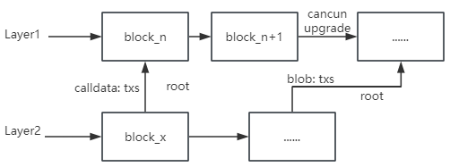
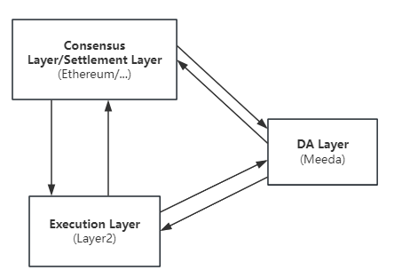
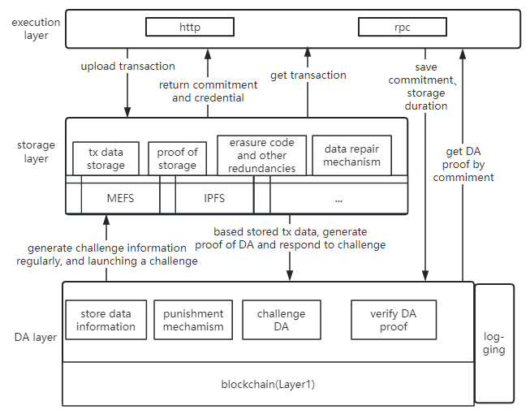

# Meeda是什么

[Memolabs](https://memolabs.org/)推出了一种高效简洁的以太坊DA解决方案，为Layer2 Rollup等执行层提供了可靠的数据可用性保障。根据不同的成本选择，提供不同程度的可用性保障。

这一方案被命名为Meeda。抽取MEMO、Ethereum、data availability中的字母，并且与Memolabs推出的比特币数据可用性解决方案Mooda进行联动，前两个字母共同组成MEMO（Memolabs推出的底层分散式云存储系统）。

## DA问题

对于区块链来说，数据可用性（DA）是一件很重要的事情。众所周知，共识是组成区块链的重要一环，而节点要想达成共识，就必须要保障可靠的数据可用性。节点可以访问到当前区块的交易数据，从而验证交易是否正确，以此防范恶意交易上链，维持区块链正确的“记账”记录，保障区块链的安全可靠性。

但是在像以太坊这样的整体区块链，DA通常作为单个系统设计的一部分，在区块空间有限而区块空间利用率较高时，Gas费会越来越高，单笔交易成本越来越高，用户体验会越差，Web3的发展也会受制。

以太坊最近几年也意识到了扩容问题，开始探索各种链下扩容解决方案，当前，Rollups已经成为流行的解决方案，但是在Web3生态繁荣、区块空间需求较高时，仍然面临Gas费过高问题。

### 当前DA解决方案

基于这种现状，当前主要有两种解决方案。第一种是优化Layer2的存储开销方案，比如以太坊的Danksharding提案 ，目前是采用了EIP-4844，实现了blob交易方式，降低Layer2在依赖以太坊作为数据可用性层的存储开销；第二种是模块化区块链方案，将执行层、共识层、数据可用性层分开设计，比如Celestia项目，旨在通过提供可插拔的共识网络来简化区块链部署。

## Meeda解决方案

### Meeda概览

当前Layer2作为以太坊的扩展方案，已经能够安全可靠的对Layer1进行扩展，提升吞吐量并降低交易费开销。但其仍存在一个问题：无法降低数据的同步开销和存储开销。原始的交易数据仍然需要提交到L1链上，L1上的全节点仍需要同步这些交易数据。即使有一些别的方案，如ERC-4337来压缩部分交易数据，以及EIP-4844引入了`blob`交易类型，但效果仍旧有限。最直观的体现就是，这些交易数据存放在L1链上仍需要支付高昂的gas费用，尽管这些费用是字节费用而非执行费用。

究其根本，还是因为Layer2将以太坊L1链当作自己的DA层（Data Availability，数据可用性）。而Meeda将数据放在链下存储，获取数据用的索引和保证数据可靠性的承诺证明放在链上存储。在保证了数据可用性的同时，也降低了链上的同步开销和存储开销，最大程度扩展区块链。而保证数据安全性则依靠Meeda层对应的挑战与验证机制，因此Meeda的接入也非常简洁高效，可以兼容任何的Layer2链。

Meeda可以作为Layer2的数据可用性解决方案，为Layer2提供低成本、高可扩展的数据可用性保障，与以太坊等区块链形成可靠的三角关系。也可以与模块化解决方案合作，作为数据可用性层参与模块化区块链，给开发人员和用户提供更加简洁方便的Web3构建和使用途径。

在链下，发布交易的节点将交易信息上传至Meeda，Meeda保障交易信息的可用性，节点可以快速方便地读取交易数据。在链上，Meeda需要定期往链上提交数据可用性证明，证明通过则可以认为用户数据的可用性得到保障，证明失败则会触发数据修复。其中，文件可用性证明的验证方式高效且低成本，采用乐观式多轮交互验证方式、KZG多项式承诺等技术实现这一特点；Meeda对交易数据进行可用性抽查，并且配置纠删码和多备份的灵活方案，从而极大地提高了数据可用性。

### Meeda架构

Meeda本身逻辑分为链下和链上两部分。链下部分称为存储层，链上部分称为DA层。通过将数据放在链下存储、获取数据用的索引和保证数据可靠性的承诺证明放在链上存储这一设计方式，在保证了数据可用性的同时，也降低了链上的同步开销和存储开销，最大程度扩展区块链。

具体来讲，链下部分负责存储交易数据，提供数据读取功能，响应数据可用性证明挑战，进行数据修复。链上部分负责保障数据可用性。主要表现在记录交易数据的承诺值以及元数据信息，生成存储挑战信息，记录链下提交的数据可用性证明，响应可用性欺诈证明，激励数据修复。

