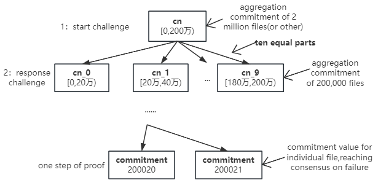

# Meeda detailed description

This article explains in detail the overall interaction process of Meeda from a developer's perspective for developers to discuss and communicate with.

## Upload Transaction Data

The execution layer uploads the transaction data, and Meeda will generate a KZG polynomial commitment `Commitment` based on the transaction data. This value can not only uniquely identify the block transaction data, but also be used to subsequently verify the correctness of the data availability certificate. The promise value occupies 96 bytes and is expressed in the `bytes32[4]` format in the contract. The application layer uploads the commitment value and metadata information of the transaction data to blockchains such as Ethereum for persistent storage of the execution layer transaction data.

&nbsp;
Transaction data will be divided into multiple slices, and erasure coding or multiple backup technologies are used for data redundancy, which greatly increases the cost of node evil. Memolabs' RAFI technology is used to realize risk-aware fault identification, this increases overall data availability in less time.

## Download Data

Any node in the execution layer can easily access transaction data based on the commitment value of the transaction data. With Meeda's data availability guarantee, light nodes will be able to verify the availability of data without downloading all data.

## Generate Verification Information

According to the kzg polynomial commitment scheme and decentralization features, a pseudo-random number `rnd` will be generated regularly by the contract to challenge the storage layer. The storage layer determines which files need to be sampled and challenged based on the random number, and then generates data availability certificates for these files to be challenged based on the random number.

&nbsp;
The data availability layer will ensure that the pseudo-random number is unpredictable and will only be generated within a specific short period of time, thereby preventing the storage layer from using time loopholes to falsify and avoid punishment.

&nbsp;
The storage layer needs to submit a certificate within a certain short period of time. If the certificate is not submitted after the validity period, it will be regarded as a challenge failure. Specific nodes in the storage layer will be punished and the data repair mechanism will also be triggered.

&nbsp;
Based on pseudo-random numbers, the sampled files to be challenged are determined to ensure that the selected files are random and unpredictable. The sampling number is calculated based on probability theory to ensure that each challenge has a 99.999% probability of finding faulty data.

## Generate Proof and Submit

The storage layer obtains the data holding certificates of the files to be verified off-chain, aggregates these certificates, and submits the aggregated certificates and aggregated commitment values to the chain.

&nbsp;
Proofs submitted by the storage layer are considered correct by default, thereby reducing verification overhead and reducing data availability costs.

## Multiple Rounds of Interactive Optimistic Verification

After the storage layer submits the proof, in order to reduce the cost of the proof, multiple rounds of interactive optimistic verification are adopted. Meeda assumes that the aggregated commitment value is correct, and any participant can challenge the aggregated commitment value for fraudulent behavior.

&nbsp;
Participants can question the correctness of the aggregation commitment. Since the aggregation proof has been verified to be correct relative to the aggregation commitment, therefore, as long as the aggregate commitment value is correct relative to the pseudo-random number `rnd`, then the data availability certificate will pass.

&nbsp;

For the verification of aggregated commitment values, we adopt multiple rounds of interactive verification. When the amount of data is large, in order to ensure high availability of data, the amount of data for sampling inspection is also correspondingly large. In order to reduce the cost of verification calculation, we divide the aggregated commitment value into ten equal parts. For each challenge, the challenger selects one of them. To challenge the challenge, the data availability layer only needs to perform ten aggregation domain calculations. If the questioned part is proved to be correct by the contract calculation of the data availability layer, then the challenger fails and will forfeit the deposit.

&nbsp;

If through contract calculation, it is found that there is indeed wrong information in the aggregated part being questioned, then the questioner will again divide the questioned part into ten equal parts, select one part for questioning, until the individual block transaction data is finally determined, the questioner and the data The availability layer has reached a consensus on the faulty block transaction data, doubters will be rewarded, and the storage layer node that caused the data failure will be punished.

## Summarize

Meeda provides an efficient and simple DA solution method for Ethereum Layer 2, especially Rollups, through kzg polynomial commitment technology, elliptic curve calculation, data availability sampling, erasure code multiple backup redundancy mechanism, efficient and low-cost availability guarantee on the chain, etc.